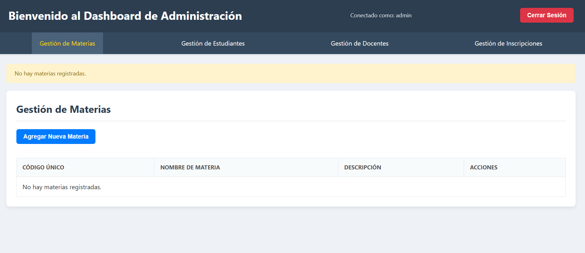

# Proyecto: Sistema de Gestion Academica Integral

Este proyecto es una API RESTful desarrollada con Spring Boot, diseñada para gestionar aspectos clave de un sistema educativo. Permite la administración de estudiantes, docentes, materias, cursos, asistencias, inscripciones, notas y relaciones entre entidades académicas.
* **GRUPO**: Grupo 14 
* **INTEGRANTES**: 
	* Aruquipa Coca José Andres
	* Callisaya Ramos Herlan Gabriel
	* Marca Churqui Edith Jhomara
	* Tinta Chura Luz Gabriela
	* Zeballos Romero Daniel Alfredo

## 1. Tecnologías Utilizadas

* **Lenguaje**: Java 17+
* **Framework**: Spring Boot 3.x
* **Gestor de Dependencias**: Maven
* **Base de Datos**: PostgreSQL (configurable)
* **ORM / JPA**: Hibernate
* **Seguridad**: Spring Security (con JWT para autenticación)
* **Validación**: Jakarta Validation (Hibernate Validator)
* **Herramientas de Desarrollo**: Lombok
* **Pruebas**: JUnit, Mockito
* **Documentación de API**: (Opcional, si usas Swagger/OpenAPI) Springdoc-OpenAPI

## 2. Configuración e Instalación

### 2.1. Requisitos Previos

Asegúrate de tener instalado lo siguiente:

* **Java Development Kit (JDK)**: Versión 17 o superior.
* **Maven**: Versión 3.6 o superior.
* **PostgreSQL**: Instancia de base de datos activa.
* **IDE**: IntelliJ IDEA, Eclipse o VS Code con soporte para Spring Boot.

### 2.2. Configuración de la Base de Datos

1.  **Crear la Base de Datos**: Crea una base de datos PostgreSQL. Por ejemplo: `CREATE DATABASE academico_db;`
2.  **Configurar `application.properties`**: Abre el archivo `src/main/resources/application.properties` y actualiza las credenciales de tu base de datos:

    ```properties
    spring.datasource.url=jdbc:postgresql://localhost:5432/academico_db
    spring.datasource.username=tu_usuario
    spring.datasource.password=tu_contraseña
    spring.jpa.hibernate.ddl-auto=update # o create si es la primera vez, luego cambiar a update
    spring.jpa.properties.hibernate.dialect=org.hibernate.dialect.PostgreSQLDialect
    spring.jpa.show-sql=true
    ```

### 2.3. Ejecución del Proyecto

1.  **Clonar el Repositorio**:
    ```bash
    git clone [https://github.com/tu-usuario/tu-repositorio.git](https://github.com/tu-usuario/tu-repositorio.git)
    cd tu-repositorio
    ```
2.  **Construir el Proyecto con Maven**:
    ```bash
    mvn clean install
    ```
3.  **Ejecutar la Aplicación**:
    ```bash
    mvn spring-boot:run
    ```
    La aplicación se iniciará en `http://localhost:8080` (o el puerto configurado).

## 3. Arquitectura de Seguridad (Spring Security & JWT)

La API utiliza Spring Security para la protección de rutas y autenticación, implementando JSON Web Tokens (JWT) para gestionar sesiones sin estado.

### 3.1. Configuración Central de Seguridad (`SecurityConfig.java`)

* **CSRF Deshabilitado**: Adecuado para APIs REST que usan JWT.
* **Gestión de Sesiones `STATELESS`**: No se mantiene el estado de sesión; cada solicitud debe incluir un JWT.
* **Manejo de Excepciones de Autenticación**: `JwtAuthenticationEntryPoint` gestiona errores de autenticación (HTTP 401).
* **Integración del Filtro JWT**: `JwtAuthenticationFilter` valida el token y carga la información del usuario en el contexto de seguridad.
* **Reglas de Autorización por Ruta**:
    * `/api/auth/**`, `/api/public/**`: Accesibles sin autenticación.
    * `/api/admin/**`: Requiere `ROL_ADMIN`.
    * `/api/docentes/**`: Requiere `ROL_DOCENTE` o `ROL_ADMIN`.
    * `/api/estudiantes/**`: Requiere `ROL_ESTUDIANTE`, `ROL_DOCENTE` o `ROL_ADMIN`.
    * Otras rutas: Requieren autenticación (`.anyRequest().authenticated()`).

### 3.2. Protección a Nivel de Método (`@PreAuthorize`)

Habilitado por `@EnableMethodSecurity(prePostEnabled = true)`, permite control granular de acceso a métodos:

* `@PreAuthorize("hasRole('ROL_ESTUDIANTE')")`: Acceso solo para `ROL_ESTUDIANTE`.
* `@PreAuthorize("hasAnyRole('ROL_DOCENTE', 'ROL_ADMIN')")`: Acceso para `ROL_DOCENTE` o `ROL_ADMIN`.
* Autorización dinámica (ej. `hasRole('ADMIN') or (#ci == authentication.principal.username and hasRole('ESTUDIANTE'))`) para acceso a recursos propios.

## 4. Manejo de Repositorios (Operaciones CRUD)

Esta sección describe los endpoints RESTful para interactuar con las entidades de la API.

### 4.1. Entidad: `Asiste`

Registra la asistencia de un estudiante a un curso en una fecha específica.

* **Atributos clave**: `idAsiste`, `estudianteCi`, `cursoIdCurso`, `fecha`, `presente`.
* **DTO (`AsisteDTO`)**:
    ```json
    {
        "idAsiste": 1,
        "estudianteCi": "1234567",
        "cursoIdCurso": 1,
        "fecha": "2024-05-20",
        "presente": true
    }
    ```
* **Endpoints REST**:
    * `GET /api/asistencias`: Obtener todas las asistencias.
    * `GET /api/asistencias/{id}`: Obtener asistencia por ID.
    * `GET /api/asistencias/estudiante/{estudianteCi}`: Obtener asistencias por estudiante.
    * `GET /api/asistencias/curso/{cursoIdCurso}`: Obtener asistencias por curso.
    * `GET /api/asistencias/estudiante/{estudianteCi}/curso/{cursoIdCurso}`: Obtener asistencias de un estudiante en un curso.
    * `POST /api/asistencias`: Crear asistencia.
    * `PUT /api/asistencias/{id}`: Actualizar asistencia.
    * `DELETE /api/asistencias/{id}`: Eliminar asistencia.
    * `GET /api/asistencias/{id}/bloqueo`: Obtener asistencia con bloqueo pesimista.

* **Ejemplos de Peticiones**: (Aquí irían los ejemplos cURL/HTTP detallados de POST, GET, PUT, DELETE para `Asiste` que ya generamos)

    * **POST**:
        ```http
        POST /api/asistencias HTTP/1.1
        Host: localhost:8080
        Content-Type: application/json

        {
            "estudianteCi": "1234567",
            "cursoIdCurso": 1,
            "fecha": "2024-05-20",
            "presente": true
        }
        ```
    * **GET por ID**:
        ```http
        GET /api/asistencias/1 HTTP/1.1
        Host: localhost:8080
        ```
    * **(Resto de ejemplos GET, PUT, DELETE de Asiste)**

* **Consultas Personalizadas**:
    * `obtenerAsistenciasPorEstudiante(String estudianteCi)`
    * `obtenerAsistenciasPorCurso(Integer cursoIdCurso)`
    * `obtenerAsistenciasDeEstudianteEnCurso(String estudianteCi, Integer cursoIdCurso)`
    * `obtenerAsistenciaConBloqueo(Long idAsiste)`

### 4.2. Entidad: `SeDa`

Modela la relación donde una `Materia` se imparte en un `Curso`.

* **Atributos clave**: `idSeDa`, `materiaCodigoUnico`, `cursoIdCurso`.
* **Restricción de Unicidad**: `materia_codigo_unico` y `curso_id_curso` son únicos en combinación.
* **DTO (`SeDaDTO`)**:
    ```json
    {
        "idSeDa": 1,
        "materiaCodigoUnico": "MAT201",
        "cursoIdCurso": 101
    }
    ```
* **Endpoints REST**:
    * `GET /api/materiacurso`: Obtener todas las relaciones Materia-Curso.
    * `GET /api/materiacurso/{id}`: Obtener relación por ID.
    * `GET /api/materiacurso/materia/{materiaCodigoUnico}`: Obtener relaciones por materia.
    * `GET /api/materiacurso/curso/{cursoIdCurso}`: Obtener relaciones por curso.
    * `GET /api/materiacurso/materia/{materiaCodigoUnico}/curso/{cursoIdCurso}`: Obtener relación específica por materia y curso.
    * `POST /api/materiacurso`: Crear relación.
    * `PUT /api/materiacurso/{id}`: Actualizar relación.
    * `DELETE /api/materiacurso/{id}`: Eliminar relación.
    * `GET /api/materiacurso/{id}/bloqueo`: Obtener relación con bloqueo pesimista.

* **Ejemplos de Peticiones**: (Aquí irían los ejemplos cURL/HTTP detallados de POST, GET, PUT, DELETE para `SeDa` que ya generamos)

    * **POST**:
        ```http
        POST /api/materiacurso HTTP/1.1
        Host: localhost:8080
        Content-Type: application/json

        {
            "materiaCodigoUnico": "MAT201",
            "cursoIdCurso": 101
        }
        ```
    * **GET por ID**:
        ```http
        GET /api/materiacurso/1 HTTP/1.1
        Host: localhost:8080
        ```
    * **(Resto de ejemplos GET, PUT, DELETE de SeDa)**

* **Consultas Personalizadas**:
    * `obtenerRelacionesPorMateria(String materiaCodigoUnico)`
    * `obtenerRelacionesPorCurso(Integer cursoIdCurso)`
    * `obtenerRelacionPorMateriaYCurso(String materiaCodigoUnico, Integer cursoIdCurso)`
    * `obtenerRelacionConBloqueo(Long idSeDa)`

### 4.3. Entidad: `Curso`

Representa una instancia específica de una oferta educativa.

* **Atributos clave**: `idCurso`, `dia`, `horario`, `semestre`, `anio`.
* **DTO (`CursoDTO`)**:
    ```json
    {
        "idCurso": 1,
        "dia": "Lunes",
        "horario": "10:00 a 12:00",
        "semestre": "2024-1",
        "anio": 2024
    }
    ```
* **Endpoints REST**:
    * `GET /api/cursos`: Obtener todos los cursos.
    * `GET /api/cursos/{id}`: Obtener curso por ID.
    * `GET /api/cursos/buscar/semestre?valor={semestre}`: Buscar cursos por semestre.
    * `GET /api/cursos/buscar/anio?valor={anio}`: Buscar cursos por año.
    * `GET /api/cursos/buscar/dia?valor={dia}`: Buscar cursos por día.
    * `POST /api/cursos`: Crear curso.
    * `PUT /api/cursos/{id}`: Actualizar curso.
    * `DELETE /api/cursos/{id}`: Eliminar curso.
    * `GET /api/cursos/{id}/bloqueo`: Obtener curso con bloqueo pesimista.

* **Ejemplos de Peticiones**: (Aquí irían los ejemplos cURL/HTTP detallados de POST, GET, PUT, DELETE para `Curso` que ya generamos)

    * **POST**:
        ```http
        POST /api/cursos HTTP/1.1
        Host: localhost:8080
        Content-Type: application/json

        {
            "dia": "Lunes",
            "horario": "08:00 a 10:00",
            "semestre": "2024-1",
            "anio": 2024
        }
        ```
    * **GET por ID**:
        ```http
        GET /api/cursos/1 HTTP/1.1
        Host: localhost:8080
        ```
    * **(Resto de ejemplos GET, PUT, DELETE de Curso)**

* **Consultas Personalizadas**:
    * `obtenerTodosLosCursos()`
    * `obtenerCursoPorId(Integer id)`
    * `buscarCursosPorSemestre(String valor)`
    * `buscarCursosPorAnio(Integer valor)`
    * `buscarCursosPorDia(String valor)`
    * `obtenerCursoConBloqueo(Integer id)`

## 5. Diseño y Arquitectura de la Base de Datos

### 5.1. Descripción de Entidades Principales

El modelo de datos se basa en un diseño relacional que representa las entidades clave del sistema educativo:

* **`ESTUDIANTE`**: `ci` (PK), `nombre`, `apellido`, `email`, `fecha_Nac`.
* **`DOCENTE`**: `ci` (PK), `nombre`, `apellido`, `email`, `fecha_Nac`, `departamento`, `noEmpleado`.
* **`MATERIA`**: `codigoUnico` (PK), `nombreMateria`, `descripcion`.
* **`CURSO`**: `idCurso` (PK), `dia`, `horario`, `semestre`, `anio`.

Entidades de relación (tablas de unión para relaciones N:M):

* **`asiste`**: `ESTUDIANTE_ci`, `CURSO_idCurso`, `fecha`, `presente`.
* **`imparte`**: `DOCENTE_ci`, `MATERIA_codigoUnico`.
* **`inscrito`**: `ESTUDIANTE_ci`, `MATERIA_codigoUnico`, `fechaInscripcion`.
* **`registra_nota`**: `ESTUDIANTE_ci`, `MATERIA_codigoUnico`, `nota`, `evaluacion`, `fechaEvaluacion`.
* **`se_da`**: `MATERIA_codigoUnico`, `CURSO_idCurso`.
* **`materia_prerequisito`**: `MATERIA_codigoUnico`, `MATERIA_prerequisito_codigoUnico`.

### 5.2. Validaciones de Campos en Modelos (Anotaciones, Restricciones)

* **Anotaciones JPA**: `nullable = false` en `@Column` y `@JoinColumn` para obligatoriedad. `@UniqueConstraint` en `@Table` para asegurar la unicidad de combinaciones (ej., `se_da`).
* **Validaciones DTO (`jakarta.validation.constraints`)**: `@NotBlank`, `@NotNull`, `@Size`, `@Email`, `@PastOrPresent` para validar entrada de datos, activadas por `@Valid` en controladores.

### 5.3. Validaciones a Nivel de Servicio y Controladores

* **Capa de Servicio**: Implementa reglas de negocio complejas (ej., verificación de existencia de entidades relacionadas), lanzando excepciones personalizadas manejadas por un `GlobalExceptionHandler`.
* **Capa de Controlador**: Utiliza `@Valid` para disparar validaciones del DTO, y delega al servicio la validación de recursos en `@PathVariable` o `@RequestParam`.

### 5.4. Consideraciones de Concurrencia (Transacciones, Sincronización de Accesos Críticos)

* **Transacciones (`@Transactional`)**: Envuelve operaciones de escritura y lecturas críticas para asegurar atomicidad y consistencia.
* **Bloqueo Pesimista (`@Lock(LockModeType.PESSIMISTIC_WRITE)`)**: Utilizado en métodos específicos para bloquear filas de la DB y asegurar exclusividad en la modificación de un registro.
* **Manejo de Excepciones de Concurrencia**: El `GlobalExceptionHandler` maneja excepciones relacionadas (ej., `PessimisticLockingFailureException`).
* **Restricciones de Unicidad en DB**: Las restricciones `UNIQUE` a nivel de base de datos previenen duplicados concurrentes.

## 6. Manejo Global de Errores

Se implementa un `GlobalExceptionHandler` (Clase con `@ControllerAdvice` y `@ExceptionHandler`) para centralizar el manejo de excepciones y proporcionar respuestas HTTP consistentes y significativas.

* **Errores de Validación (`MethodArgumentNotValidException`)**: Captura errores de `@Valid` y devuelve un HTTP 400 Bad Request con detalles de los campos inválidos.
* **Errores de Negocio (`BusinessException`, `NotFoundException`, etc.)**: Excepciones personalizadas lanzadas por la capa de servicio que resultan en respuestas HTTP específicas (ej., 404 Not Found, 409 Conflict).
* **Errores Inesperados (`Exception`)**: Captura cualquier otra excepción no manejada y devuelve un HTTP 500 Internal Server Error, ocultando detalles internos.

## 7. Contribución

¡Las contribuciones son bienvenidas! Si deseas contribuir a este proyecto, por favor sigue estos pasos:

1.  Haz un "fork" del repositorio.
2.  Crea una nueva rama (`git checkout -b feature/nueva-funcionalidad`).
3.  Realiza tus cambios y haz "commit" (`git commit -m 'feat: Añadir nueva funcionalidad'`).
4.  Haz "push" a la rama (`git push origin feature/nueva-funcionalidad`).
5.  Abre un "pull request" explicando tus cambios.
6.  


## 8. Manejo y ejecucion del sistema (Manual de Usuario)
Para empezar, se tiene una pantalla para loguearse con distintos roles.


A contimuacion se muestra cada login de cada rol por separado:


### 2.1 Login Admin

Una vez logueado como adminnstrador se versa la siguiente pantalla con las siguiente acciones:



### 2.1 Login Docente

Una vez logueado como docente se versa la siguiente pantalla con las siguiente acciones:


### 2.1 Login Estudiante

Una vez logueado como docente se versa la siguiente pantalla con las siguiente acciones:


---


